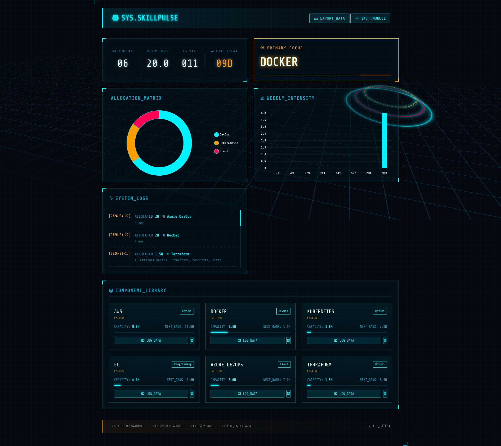

# 🌌 SkillPulse: Holographic Command Center

SkillPulse is a futuristic, high-end **Skill Tracking & Analytics Dashboard** designed with a Sci-Fi Holographic HUD aesthetic. It allows users to monitor their learning progress, track daily streaks, and visualize their skill matrix through a technical, data-driven interface.



---

## ⚡ Features

- **Holographic HUD UI:** A stunning, pitch-black dashboard with neon cyan accents, 3D animated grids, and floating data rings.
- **Bento-Box Analytics:** Modular data visualization using **Chart.js** for category distribution and weekly learning intensity.
- **Gamified Progression:** 
    - **Active Streak:** Tracks consecutive days of learning telemetry.
    - **XP Leveling:** Skills automatically rank up (LVL.1, LVL.2, etc.) based on total hours logged.
- **Real-time Telemetry:** Live activity feed and system status monitoring.
- **Data Portability:** One-click CSV export for your entire skill matrix.
- **Build Verification Pipeline:** Automated GitHub Actions workflow to validate code and container health on every push.

---

## 🛠 Tech Stack

- **Frontend:** Vanilla HTML5, CSS3 (3D Transforms), JavaScript (ES6+).
- **Backend:** Go (Golang) with Gin Framework.
- **Database:** MySQL 8.4 (Persistent Storage).
- **Reverse Proxy:** Nginx (Static serving + API Gateway).
- **Orchestration:** Docker & Docker Compose.

---

## 🚀 Getting Started

### Prerequisites
- Docker & Docker Compose installed on your machine.

### Local Installation

1. **Clone the Repository:**
   ```bash
   git clone https://github.com/shubhamsharma39/Skill-pulse.git
   cd Skill-pulse
   ```

2. **Environment Setup:**
   Create a `.env` file in the root directory (you can use `.env.example` as a template):
   ```bash
   cp .env.example .env
   ```

3. **Launch the Command Center:**
   ```bash
   docker compose up --build -d
   ```

4. **Access the Dashboard:**
   Open your browser and navigate to:
   `http://localhost:8081`

---

## 📂 Project Structure

```text
├── .github/workflows/   # CI Pipeline (Build Verification)
├── backend/             # Go REST API source code
├── frontend/            # HTML/CSS/JS (Holographic UI)
├── nginx/               # Reverse proxy configuration
├── mysql/               # Database initialization scripts
└── docker-compose.yml   # Multi-container orchestration
```

---

## 🏗 CI/CD Pipeline

The project includes a **Build Verification Pipeline** (`.github/workflows/ci.yml`). 
- **Automated Validation:** Runs on every `push` to the `main` branch.
- **Build Check:** Verifies that the Go backend compiles and the Docker environment is healthy.
- **Zero Configuration:** No external secrets or credentials required.

---

## 🛡 License

This project is licensed under the MIT License.

---
**Developed with 💙 by [Shubham Sharma](https://github.com/shubhamsharma39)**
